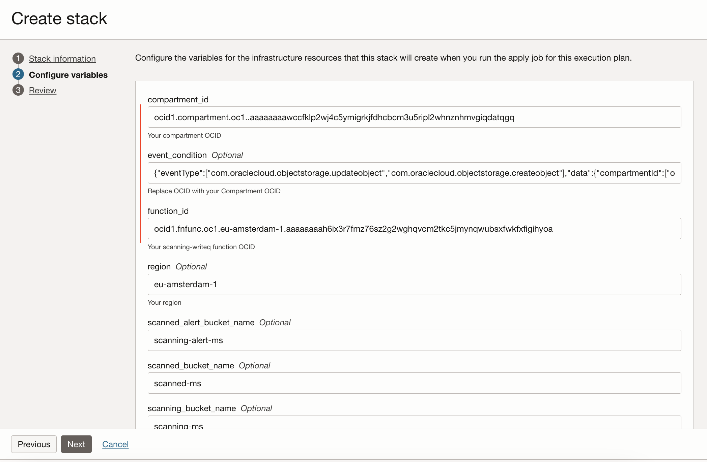
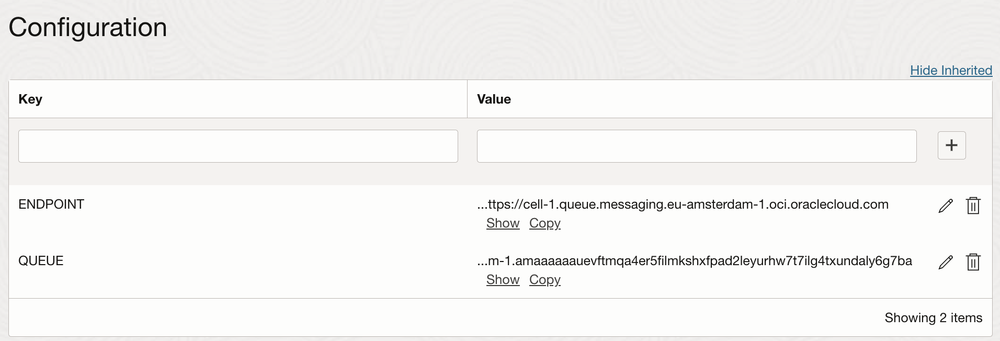
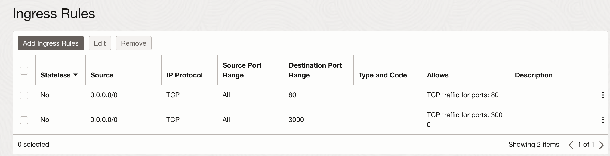
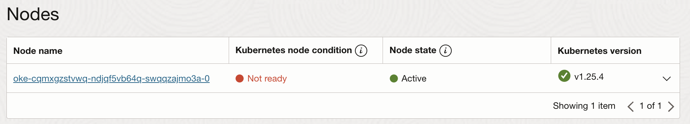
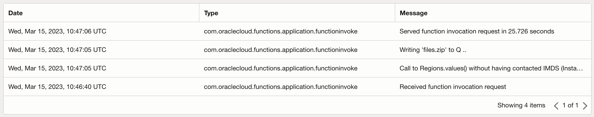
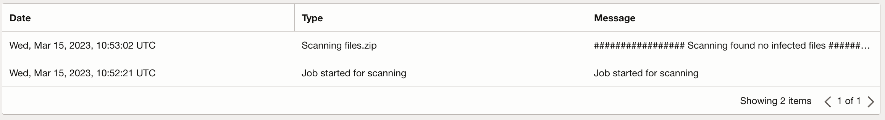

# arch-virus-scanning-with-oke-autoscaling

 

## Introduction

This architecture creates a virus scanner to scan files uploaded to Oracle Cloud Infrastructure (OCI) Object Storage. The virus scanner is deployed on Oracle Container Engine for Kubernetes and uses Kubernetes Event-driven Autoscaling to manage virus scan jobs.

Virus scan jobs are configured to scan single files and zip files. When multiple files are uploaded to the created object storage bucket, virus scan jobs are executed on Oracle Container Engine for Kubernetes using OCI Events and OCI Queue (max 3 jobs simultaneously by default, but this can be changed using the Kubernetes Event-driven Autoscaling configuration). After scanning, files are moved to object storage buckets depending on the scan result (clean or infected). If there are no files to scan, the Kubernetes Event-driven Autoscaler scales down the nodes in pool 2 to zero. When scanning, the Kubernetes Event-driven Autoscaler scales nodes up.

The virus scanner uses a third-party named Trellix's free trial uvscan. The application code is written mostly in NodeJS and uses the Oracle Cloud Infrastructure SDK for JS.

## Getting started

### Clone the repo to localhost

<pre>
git clone https://github.com/oracle-devrel/arch-virus-scanning-with-oke-autoscaling
</pre>

## Dynamic Groups and Policies

### Create Dynamic Groups for Policies

- In Cloud UI create for the function (<i>resource principal</i>):

<pre>
ALL {resource.type = 'fnfunc', resource.compartment.id = 'ocid1.compartment.oc1..'}
</pre>

- For OKE and other (<i>instance principal</i>):

<pre>
ANY {instance.compartment.id = 'ocid1.compartment.oc1..'}
</pre>

### Create Policies

- In Cloud UI create for example:

<pre>
Allow dynamic-group &lt;YOUR FUNCTION DYNAMIC GROUP&gt; to manage all-resources in compartment &lt;YOUR COMPARTMENT&gt;
Allow dynamic-group &lt;YOUR OTHER DYNAMIC GROUP&gt; to manage all-resources in compartment &lt;YOUR COMPARTMENT&gt;
</pre>

## Function

### Create OCIR for the function

- In Cloud UI create Container registry <code>scanning-writeq</code> for the function created in the next step

### Create Function for Object Storage emitted Events

This function <code>scanning-writeq</code> will ingest the events emitted by the object storage bucket <code>scanning-ms</code> when file(s) are uploaded to the bucket and then the function will write the file to OCI Queue <code>scanning</code> for OKE jobs to process with virus scanning.

- In Cloud UI create Function Application <code>scanning-ms</code>

- In Cloud UI enable also logging for the <code>scanning-ms</code> application

- In Cloud Shell (as part of the Cloud UI) follow the instructions of the  <b>"Getting started"</b> for the application <code>scanning-ms</code> and run:

<pre>
<b>fn init --runtime node scanning-writeq</b>
Creating function at: ./scanning-writeq
Function boilerplate generated.
func.yaml created.
</pre>

- In Cloud Code Editor (as part of the Cloud UI) navigate to <code>scanning-writeq</code> directory and copy/paste <code>func.js</code> and <code>package.json</code> file contents from localhost <a href="scanning-writeq/"><code>scanning-writeq</code></a> directory

- Then in Cloud Shell run:

<pre>
cd scanning-writeq
fn -v deploy --app scanning-ms
</pre>

This will create and push the OCIR image and deploy the Function <code>scanning-writeq</code> to the application <code>scanning-ms</code>

## OKE Cluster

### Create OKE with 2 node pools

- In Cloud UI create OKE cluster using the "Quick create" option

- Use default settings for the cluster creation, except for the <code>node pool size</code> that can be <b>1</b>

- Add a second Node Pool <code>pool2</code> with <code>pool size 0</code> with defaults for the rest of the settings. If
preferred the shape can be adjusted to use a larger shape to process the virus scans faster

- Create cluster access from <code>localhost</code> to the OKE cluster. Click the <code>Access Cluster</code> button for details for the <code>Local Access</code> option. This requires <code>oci cli</code> installed in <code>localhost</code>

## Other resources

### Create the other resources with Terraform

- In Cloud UI create Resource Manager Stack

- Drag&drop <code>terraform</code> directory from <code>localhost</code> to Stack Configuration

- Use default settings and click continue

- In the Configure variables (Step 2 for the Stack creation) fill in the <code>compartment_id</code> of your compartment OCID, <code>function_id</code> of your <code>scanning-writeq</code> function OCID and replace the <code>OCID</code> of the <code>event_condition</code> with your compartment OCID

- Click continue and create the Stack. Create the resources by clicking <code>Apply</code> button

This will create <b>three Object Storage buckets</b>, an <b>Event rule</b>, a <b>Log Group</b> and a <b>Log</b> and an <b>OCI Queue</b> for the virus scanning to operate on OKE

## Configure function

### Configure the function to write object upload events to the queue

- In Cloud UI add <code>scanning-writeq</code> function configuration

- Add configuration key <code>QUEUE</code> with value of the OCID of the <code>scanning-ms</code> queue and key <code>ENDPOINT</code> with the <code>endpoint</code> value of the <code>scanning-ms</code> queue

## Application images for OKE

### Download uvcan software

- Download <code>uvscan</code> Command Line Scanner for Linux-64bit free trial from https://www.trellix.com/en-us/downloads/trials.html?selectedTab=endpointprotection

- Download uvscan <code>datafile</code> with wget e.g.

<pre>
wget https://update.nai.com/products/commonupdater/current/vscandat1000/dat/0000/avvdat-10637.zip
</pre>

Copy the downloaded files under <code>scanning-readq-job</code> directory in <code>localhost</code>

<pre>
cd scanning-readq-job
ls -la
..
avvdat-10637.zip
cls-l64-703-e.tar.gz
..
</pre>

Note that the actual file names can be different from the ones above.

### Create OCIR for images

In Cloud UI create Container registries <code>scanning-readq</code> and <code>scanning-readq-job</code>

### Build images and push to OCIR

In localhost build the application images using Docker and push to OCIR:

<pre>
cd scanning-readq
docker build -t &lt;REGION-CODE&gt;.ocir.io/&lt;YOUR TENANCY NAMESPACE&gt;/scanning-readq:1.0
docker push &lt;REGION-CODE&gt;.ocir.io/&lt;YOUR TENANCY NAMESPACE&gt;/scanning-readq:1.0
</pre>

For the <code>scanning-readq-job</code> modify the file names in <code>Dockerfile</code> for 
uvscan and it's data file to match the filenames that were downloaded earlier in 
<a href="scanning-readq-job/Dockerfile#L15">line 15</a> and <a href="scanning-readq-job/Dockerfile#L19">lines 19-21</a>
before building.

<pre>
cd scanning-readq-job
docker build -t &lt;REGION-CODE&gt;.ocir.io/&lt;YOUR TENANCY NAMESPACE&gt;/scanning-readq-job:1.0
docker push &lt;REGION-CODE&gt;.ocir.io/&lt;YOUR TENANCY NAMESPACE&gt;/scanning-readq-job:1.0
</pre>

### Create OCIR secret for OKE

Create secret <code>ocirsecret</code> for the OKE cluster to be able to pull the application images from OCIR:

<pre>
kubectl create secret docker-registry ocirsecret --docker-username '&lt;YOUR TENANCY NAMESPACE&gt;/oracleidentitycloudservice/&lt;YOUR USERNAME&gt;'  --docker-password '&lt;YOUR ACCESS TOKEN&gt;'  --docker-server '&lt;REGION-CODE&gt;.ocir.io'
</pre>

<a href="https://enabling-cloud.github.io/oci-learning/manual/DeployCustomDockerImageIntoOKECluster.html">More in OCI-learning</a>

### Deploy application images with kubectl

To deploy <code>scanning-readq</code> image modify the  <a href="scanning-readq/scanning-readq.yaml"><code>scanning-readq/scanning-readq.yaml</code></a> in <code>localhost</code> to match your values (in <b>bold</b>):

<pre>
apiVersion: apps/v1
kind: Deployment
metadata:
  name: scanning-readq
spec:
  replicas: 1
  selector:
    matchLabels:
      app: scanning-readq
      name: scanning-readq
  template:
    metadata:
      labels:
        app: scanning-readq
        name: scanning-readq
    spec:
      containers:
        - name: scanning-readq
          image: <b>REGION-KEY</b>.ocir.io/<b>TENANCY-NAMESPACE</b>/scanning-readq:1.0
          imagePullPolicy: Always
          ports:
          - containerPort: 3000
            name: readq-http
          env:
          - name: QUEUE
            value: "<b>ocid1.queue.oc1..</b>"
          - name: ENDPOINT
            value: "<b>https://cell-1.queue.messaging..oci.oraclecloud.com</b>"
      imagePullSecrets:
      - name: ocirsecret
</pre>

<i>Note</i>: Env variable <code>QUEUE</code> is the OCID of the <code>scanning queue</code> created in the earlier step with Terraform using Resource Manager Stack. Copy it from the Cloud UI. Copy also the value for the env var <code>ENDPOINT</code> from the Queue settings using Cloud UI

Then run:
<pre>
kubectl create -f scanning-readq/scanning-readq.yaml
</pre>

To deploy matching <code>scanning-readq service</code> in port <code>3000</code> for the 
<code>scanning-readq</code> run:

<pre>
kubectl create -f scanning-readq/scanning-readq-svc.yaml
</pre>

Modify the OKE security list <code>oke-<b>svclbseclist</b>-quick-cluster1-xxxxxxxxxx</code> by adding ingress
rule for the port 3000 to enable traffic to the service:

After adding the security rule to get the <code>EXTERNAL-IP</code> of the service run:

<pre>
kubectl get services
NAME                TYPE           CLUSTER-IP    <b>EXTERNAL-IP</b>      PORT(S)             AGE
scanning-readq-lb   LoadBalancer   10.96.84.40   <b>141.122.194.89</b>   3000:30777/TCP      6d23h
</pre>

Access the url of the <code>scanning-readq</code> service <code>http://<b>EXTERNAL-IP</b>:3000/stats</code> with curl 
or from your browser to test the access to it:

<pre>
curl http://&lt;EXTERNAL-IP&gt;:3000/stats
{"queueStats":{"queue":{"visibleMessages":0,"inFlightMessages":0,"sizeInBytes":0},"dlq":{"visibleMessages":0,"inFlightMessages":0,"sizeInBytes":0}},"opcRequestId":"07857530C320-11ED-AE89-FFC729A3C/BCA92AC274B1CC09FB9C7A6975DC609B/7D9970C765A85603727C2E125DB0F9B0"}
</pre>

To deploy <code>scanning-readq-job</code> first deploy the <a href="https://keda.sh/docs/2.9/deploy/"><b>KEDA operator</b></a>
with Helm to your OKE cluster

Then modify the  <a href="scanning-readq-job/keda.yaml"><code>scanning-readq-job/keda.yaml</code></a> in <code>localhost</code> to match your values (in <b>bold</b>):

<pre>
apiVersion: keda.sh/v1alpha1
kind: ScaledJob
metadata:
  name: scanning-readq-job-scaler
spec:
  jobTargetRef:
    template:
      spec:
        nodeSelector:
          name: pool2
        containers:
        - name: scanning-readq-job
          image: <b>REGION-KEY</b>.ocir.io/<b>TENANCY-NAMESPACE</b>/scanning-readq-job:1.0
          imagePullPolicy: Always
          resources:
            requests:
              cpu: "500m"
          env:
          - name: QUEUE
            value: "<b>ocid1.queue.oc1..</b>"
          - name: ENDPOINT
            value: "<b>https://cell-1.queue.messaging..oci.oraclecloud.com</b>"
          - name: LOG
            value: "<b>ocid1.log.oc1..</b>"
        restartPolicy: OnFailure
        imagePullSecrets:
        - name: ocirsecret
    backoffLimit: 0  
  pollingInterval: 5              # Optional. Default: 30 seconds
  maxReplicaCount: 3              # Optional. Default: 100
  successfulJobsHistoryLimit: 3   # Optional. Default: 100. How many completed jobs should be kept.
  failedJobsHistoryLimit: 2       # Optional. Default: 100. How many failed jobs should be kept.
  scalingStrategy:
    strategy: "default"
  triggers:
    - type: metrics-api
      metadata:
        targetValue: "1"
        url: "http://<b>EXTERNAL-IP</b>:3000/stats"
        valueLocation: 'queueStats.queue.visibleMessages'
</pre>

Then run:
<pre>
kubectl create -f scanning-readq-job/keda.yaml
</pre>

<i>Note</i>: Env variable <code>QUEUE</code> is the OCID of the scanning queue created in the earlier step with Terraform using Resource Manager Stack. Copy it from the Cloud UI. Copy also the value for the env var <code>ENDPOINT</code> from the Queue settings using Cloud UI. Env variable <code>LOG</code> is the OCID of the <code>scanning log</code> created in the earlier step with Terraform using Resource Manager Stack. Copy it from the Cloud UI, too. Configure also the <code>scanning-readq service</code> <code>EXTERNAL-IP</code> as the endpoint url for the <code>metrics-api</code>

## OKE Autoscaler

To autoscale the nodes in the OKE <code>pool2</code> from zero to one and <code>scanning-readq-job</code> jobs to run on the OKE autoscaler needs to be <a href="https://docs.oracle.com/en-us/iaas/Content/ContEng/Tasks/contengusingclusterautoscaler.htm">installed</a>

To do this edit the <code><a href="scanning-readq-job/cluster-autoscaler.yaml">scanning-readq-job/cluster-autoscaler.yaml</a></code> in <code>localhost</code> to match your values (in <b>bold</b>):

<pre>
---
apiVersion: v1
kind: ServiceAccount
metadata:
  labels:
    k8s-addon: cluster-autoscaler.addons.k8s.io
    k8s-app: cluster-autoscaler
  name: cluster-autoscaler
  namespace: kube-system
---
apiVersion: rbac.authorization.k8s.io/v1
kind: ClusterRole
metadata:
  name: cluster-autoscaler
  labels:
    k8s-addon: cluster-autoscaler.addons.k8s.io
    k8s-app: cluster-autoscaler
rules:
  - apiGroups: [""]
    resources: ["events", "endpoints"]
    verbs: ["create", "patch"]
  - apiGroups: [""]
    resources: ["pods/eviction"]
    verbs: ["create"]
  - apiGroups: [""]
    resources: ["pods/status"]
    verbs: ["update"]
  - apiGroups: [""]
    resources: ["endpoints"]
    resourceNames: ["cluster-autoscaler"]
    verbs: ["get", "update"]
  - apiGroups: [""]
    resources: ["nodes"]
    verbs: ["watch", "list", "get", "patch", "update"]
  - apiGroups: [""]
    resources:
      - "pods"
      - "services"
      - "replicationcontrollers"
      - "persistentvolumeclaims"
      - "persistentvolumes"
    verbs: ["watch", "list", "get"]
  - apiGroups: ["extensions"]
    resources: ["replicasets", "daemonsets"]
    verbs: ["watch", "list", "get"]
  - apiGroups: ["policy"]
    resources: ["poddisruptionbudgets"]
    verbs: ["watch", "list"]
  - apiGroups: ["apps"]
    resources: ["statefulsets", "replicasets", "daemonsets"]
    verbs: ["watch", "list", "get"]
  - apiGroups: ["storage.k8s.io"]
    resources: ["storageclasses", "csinodes"]
    verbs: ["watch", "list", "get"]
  - apiGroups: ["batch", "extensions"]
    resources: ["jobs"]
    verbs: ["get", "list", "watch", "patch"]
  - apiGroups: ["coordination.k8s.io"]
    resources: ["leases"]
    verbs: ["create"]
  - apiGroups: ["coordination.k8s.io"]
    resourceNames: ["cluster-autoscaler"]
    resources: ["leases"]
    verbs: ["get", "update"]
---
apiVersion: rbac.authorization.k8s.io/v1
kind: Role
metadata:
  name: cluster-autoscaler
  namespace: kube-system
  labels:
    k8s-addon: cluster-autoscaler.addons.k8s.io
    k8s-app: cluster-autoscaler
rules:
  - apiGroups: [""]
    resources: ["configmaps"]
    verbs: ["create","list","watch"]
  - apiGroups: [""]
    resources: ["configmaps"]
    resourceNames: ["cluster-autoscaler-status", "cluster-autoscaler-priority-expander"]
    verbs: ["delete", "get", "update", "watch"]

---
apiVersion: rbac.authorization.k8s.io/v1
kind: ClusterRoleBinding
metadata:
  name: cluster-autoscaler
  labels:
    k8s-addon: cluster-autoscaler.addons.k8s.io
    k8s-app: cluster-autoscaler
roleRef:
  apiGroup: rbac.authorization.k8s.io
  kind: ClusterRole
  name: cluster-autoscaler
subjects:
  - kind: ServiceAccount
    name: cluster-autoscaler
    namespace: kube-system

---
apiVersion: rbac.authorization.k8s.io/v1
kind: RoleBinding
metadata:
  name: cluster-autoscaler
  namespace: kube-system
  labels:
    k8s-addon: cluster-autoscaler.addons.k8s.io
    k8s-app: cluster-autoscaler
roleRef:
  apiGroup: rbac.authorization.k8s.io
  kind: Role
  name: cluster-autoscaler
subjects:
  - kind: ServiceAccount
    name: cluster-autoscaler
    namespace: kube-system

---
apiVersion: apps/v1
kind: Deployment
metadata:
  name: cluster-autoscaler-2
  namespace: kube-system
  labels:
    app: cluster-autoscaler
spec:
  replicas: 1
  selector:
    matchLabels:
      app: cluster-autoscaler
  template:
    metadata:
      labels:
        app: cluster-autoscaler
      annotations:
        prometheus.io/scrape: 'true'
        prometheus.io/port: '8085'
    spec:
      serviceAccountName: cluster-autoscaler
      containers:
        - image: fra.ocir.io/oracle/oci-cluster-autoscaler:<b>1.25.0-6</b>
          name: cluster-autoscaler
          resources:
            limits:
              cpu: 100m
            requests:
              cpu: 100m
          command:
            - ./cluster-autoscaler
            - --v=4
            - --stderrthreshold=info
            - --cloud-provider=oci-oke
            - --max-node-provision-time=25m
            - --nodes=0:5:<b>ocid1.nodepool.oc1..</b>
            - --scale-down-delay-after-add=10m
            - --scale-down-unneeded-time=10m
            - --unremovable-node-recheck-timeout=5m
            - --balance-similar-node-groups
            - --balancing-ignore-label=displayName
            - --balancing-ignore-label=hostname
            - --balancing-ignore-label=internal_addr
            - --balancing-ignore-label=oci.oraclecloud.com/fault-domain
          imagePullPolicy: "Always"
          env:
          - name: OKE_USE_INSTANCE_PRINCIPAL
            value: "true"
          - name: OCI_SDK_APPEND_USER_AGENT
            value: "oci-oke-cluster-autoscaler"
</pre>

For the autoscaler proper <code>tag</code> in the YAML above please check the <a href="https://docs.oracle.com/en-us/iaas/Content/ContEng/Tasks/contengusingclusterautoscaler.htm">autoscaler documentation</a>

The node pool is the OCID of the OKE Cluster <code>pool2</code>

To create the autoscaler run:

<pre>
kubectl create -f scanning-readq-job/cluster-autoscaler.yaml  
</pre>

## Testing

Upload a test file <code>files.zip</code> using oci cli from <code>localhost</code>
<pre>
oci os object put --bucket-name scanning-ms --region &lt;YOUR REGION&gt; --file files.zip
{
  "etag": "59dc11dc-62f3-4df4-886d-adf9c9c00dc4",
  "last-modified": "Wed, 15 Mar 2023 10:46:34 GMT",
  "opc-content-md5": "5D53dhf9MeT+gS8qJzbOAw=="
}
</pre>

Monitor the Q length using the <code>scanning-readq service</code>:
<pre>
curl http://&lt;EXTERNAL-IP&gt;:3000/stats
{"queueStats":{"queue":{<b>"visibleMessages":0</b>,"inFlightMessages":0,"sizeInBytes":0},"dlq":{"visibleMessages":0,"inFlightMessages":0,"sizeInBytes":0}},"opcRequestId":"07857530C320-11ED-AE89-FFC729A3C/BCA92AC274B1CC09FB9C7A6975DC609B/7D9970C765A85603727C2E125DB0F9B0"}
</pre>

Q length will increase to 1 after the object storage event has triggered the <code>scanning-writeq</code> function:
<pre>
curl http://&lt;EXTERNAL-IP&gt;:3000/stats
{"queueStats":{"queue":{<b>"visibleMessages":1</b>,"inFlightMessages":0,"sizeInBytes":9},"dlq":{"visibleMessages":0,"inFlightMessages":0,"sizeInBytes":0}},"opcRequestId":"0A1F2850C31F-11ED-AE89-FFC729A3C/41F3E07FC383D9E2F4EE58E4996FC179/D8097243379228D86AC64378A6701FEA"}
</pre>

<code>scanning-readq-job</code> job are scheduled:
<pre>
kubectl get pods --watch
NAME                              READY   STATUS    RESTARTS   AGE
scanning-readq-58d6bdd64c-9bbsq   1/1     Running   1          24h
scanning-readq-job-scaler-n2fs6-pn2ns   0/1     Pending   0          0s
</pre>

Wait for a while for the node in <code>pool2</code> to become available as provisioned by the OKE cluster autoscaler
for the jobs to run on:

Once the node is available the job will run:

<pre>
kubectl get pods --watch
NAME                              READY   STATUS    RESTARTS   AGE
scanning-readq-58d6bdd64c-9bbsq   1/1     Running   1          24h
scanning-readq-job-scaler-n2fs6-pn2ns   0/1     Pending   0          0s
scanning-readq-job-scaler-n2fs6-pn2ns   0/1     Pending   0          0s
scanning-readq-job-scaler-n2fs6-pn2ns   0/1     Pending   0          3m13s
scanning-readq-job-scaler-n2fs6-pn2ns   0/1     ContainerCreating   0          3m13s
scanning-readq-job-scaler-n2fs6-pn2ns   1/1     Running             0          5m11s
</pre>

While the job is running the Q will move the message to <code>inFlight</code>:

<pre>
curl http://&lt;EXTERNAL-IP&gt;:3000/stats
{"queueStats":{"queue":{"visibleMessages":0,<b>"inFlightMessages":1</b>,"sizeInBytes":9},"dlq":{"visibleMessages":0,"inFlightMessages":0,"sizeInBytes":0}},"opcRequestId":"0A1F2850C31F-11ED-AE89-FFC729A3C/41F3E07FC383D9E2F4EE58E4996FC179/D8097243379228D86AC64378A6701FEA"}
</pre>

After job has run for the virus scanning the job will remain in <code>completed</code> state:

<pre>
kubectl get pods        
NAME                                    READY   STATUS      RESTARTS   AGE
scanning-readq-58d6bdd64c-9bbsq         1/1     Running     1          24h
scanning-readq-job-scaler-n2fs6-pn2ns   0/1     Completed   0          6m1s
</pre>

Also the Q goes back to it's original state with zero messages since it was processed.

To see the log for the job run:

<pre>
kubectl logs scanning-readq-job-scaler-n2fs6-pn2ns
Job reading from Q ..
Scanning files.zip
################# Scanning found no infected files #########################
Job reading from Q ..
Q empty - finishing up 
</pre>

After a while the <code>pool2</code> will be scaled down to zero by the autoscaler if no further 
scanning jobs are running

The uploaded test <code>files.zip</code> file was moved from the <code>scanning-ms</code> bucket to
<code>scanned-ms</code> bucket in the process (assuming the test file was not infected)

<b>You can also upload multiple files and see several jobs being scheduled and run simultaneously for scanning</b>

### Investigate logs

In the Cloud UI see the log for the function application <code>scanning-ms</code>:

In the Cloud UI see the custom log <code>scanning</code> for the <code>scanning-readq-job</code> job(s):

### Prerequisites

OKE cluster with oci cli access from localhost and OCI cloud shell

## Notes/Issues

## URLs

## Contributing
This project is open source.  Please submit your contributions by forking this repository and submitting a pull request!  Oracle appreciates any contributions that are made by the open source community.

## License
Copyright (c) 2022 Oracle and/or its affiliates.

Licensed under the Universal Permissive License (UPL), Version 1.0.

See [LICENSE](LICENSE) for more details.

ORACLE AND ITS AFFILIATES DO NOT PROVIDE ANY WARRANTY WHATSOEVER, EXPRESS OR IMPLIED, FOR ANY SOFTWARE, MATERIAL OR CONTENT OF ANY KIND CONTAINED OR PRODUCED WITHIN THIS REPOSITORY, AND IN PARTICULAR SPECIFICALLY DISCLAIM ANY AND ALL IMPLIED WARRANTIES OF TITLE, NON-INFRINGEMENT, MERCHANTABILITY, AND FITNESS FOR A PARTICULAR PURPOSE.  FURTHERMORE, ORACLE AND ITS AFFILIATES DO NOT REPRESENT THAT ANY CUSTOMARY SECURITY REVIEW HAS BEEN PERFORMED WITH RESPECT TO ANY SOFTWARE, MATERIAL OR CONTENT CONTAINED OR PRODUCED WITHIN THIS REPOSITORY. IN ADDITION, AND WITHOUT LIMITING THE FOREGOING, THIRD PARTIES MAY HAVE POSTED SOFTWARE, MATERIAL OR CONTENT TO THIS REPOSITORY WITHOUT ANY REVIEW. USE AT YOUR OWN RISK. 